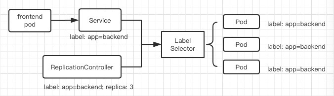

# PartOne：基本概念和术语


[TOC]

-----------------------------
## Master
    指的是集群控制节点。集群里需要一个Master节点来负责整个集群的管理和控制，基本上Kubernetes所有的控制命令都是发给它的，它来负责具体的执行过程。我们执行的命令几乎基本都是在Master节点上运行的。Master节点通常会占据一个独立的X86服务器。因为它太重要了。
### Master节点上运行着以下一组关键进程
+ 1. Kubernetes API Server
        提供了HTTP REST接口的关键服务进程，是Kubernetes里所有资源的增删改查等操作的唯一入口，也是集群控制的入口进程。
+ 2. Kubernetes Controller Manager
        Kubernetes里所有资源对象的自动化控制中心，可以理解为资源对象的"大总管"
+ 3. Kubernetes Scheduler
        负责资源调度(Pod调度)的进程，相当于公交公司的调度室。

### ps
    master节点上往往还启动了一个etcd server进程，因为kubernetes里面所有资源对象的数据都是保存在etcd中的。

-----------------------------
## Node
    除了Master,Kubernetes集群中的其它机器被称为Node节点。Node节点可以是一台物理机器，也可以是一台虚拟机。Node节点才是Kubernetes集群中的工作负载节点，每个Node都会被Master分配一些工作负载（Docker容器）。当某个Node宕机时，其上的工作负载会被Master自动转移到其它的节点上去。
### Node节点上运行着以下一组关键进程
+ 1. kubelet
        负责Pod对应的容器的创建、启停等任务，同时与Master节点密切写作，实现集群管理的基本功能。
+ 2. kube-proxy
        实现Kubernetes Service的通信和负载均衡机制的重要组件。
+ 3. Docker Engine
        Docker引擎，负责本机的容器创建和管理工作。
### 特点
+ 1. Node节点可以在运行期间动态增加到Kubernetes集群中，前提是这个节点已经正确安装、配置、启动了上述关键进程。
+ 2. 默认情况下kubelet会向Master注册自己。
+ 3. 一旦Node被纳入集群管理范围，kubelet进程就会定时向Master节点汇报自身的情况，例如OS、Docker版本、机器的CPU和内存情况、之前有哪些Pod在运行等。这样Master就可以获知每个Node的资源使用情况，并实现高效均衡的资源调度策略。当某个Node超过指定时间不上报信息，会被Master判定为“失联”,Node的状态会被标记为不可用，随后Master会触发“工作负载大转移”的自动流程。
### 常用的命令
+ 1. kubectl get nodes                   # 查看集群中有多少个node
+ 2. kubectl describe node node_name     # 显示node的详细信息

-----------------------------
## Pod
    Pod由Pause-Container、User-Container1、User-container2...组成。其中Pause容器对应的镜像属于Kubernetes平台的一部分。其它的是用户业务容器。
### 为什么要有Pause容器
+ 1. 引入和业务无关而且不易死亡的Pause容器作为Pod的根容器，以它的状态代表整个容器组的状态。
+ 2. Pod里的多个业务容器共享Pause容器的IP，以及Pause容器挂接的Volume，这样可以简化业务容器之间的通信问题，和文件共享问题。
### PodIP
    Kubernetes为每个Pod都分配一个唯一的IP地址，称为PodIP。一个Pod里的多个容器共享PodIP地址。因为Kubernetes要求底层网络支持集群内任意两个Pod之间的TCP/IP直接通信。通常使用虚拟二层网络技术来实现。
### Pod类型
#### 普通的Pod
    放在Kubernetes的etcd存储里(一旦被创建)。被放倒etcd中的Pod，随后会被Kubernetes Master调度到某个Node上，并且被绑定。随后该Pod 被 对应的Node上的kubelet进程 实例化成一组相关的Docker容器并启动起来。在默认情况下，当Pod里的某个容器停止时，kubernetes会自动检测到这个问题并且重新启动这个Pod(相当于重启Pod里面所有的容器)。如果Pod所在的Node宕机，就会将这个Node上所有的Pod重新调度到其它的节点上。
#### 静态的Pod
    放在某个具体的Node上的一个具体文件中(只在此Node上启动运行)。
### Pod的资源定义文件(yaml or json)
```yaml
apiVersion: v1
kind: Pod
metadata:
    name: myweb                         # Pod的名字
    labels:
        name: myweb
spec:
    containers:
    - name: myweb
      image: kubeguide/tomcat-app:v1
      ports: 
      - containerPort: 8080
      env:
      - name: MySQL_SERVICE_HOST
        value: 'mysql'
      - name: MySQL_SERVICE_PORT
      value: '3306'
      resources:
        requests:                      # 可以分配的最小值 也就是必须要满足的
          memory: "64Mi"
          cpu: "250m"
        limits:                        # 资源配额的最大值 超出这个值kubernetes会kill掉这个pod
          memory: "128Mi"
          cpu: "500m"
```
+ endpoint
        这里Pod的IP加上这里的容器端口就是一个endpoint。它代表的是此Pod里的一个服务进程的对外通信地址。一个Pod存在具有多个endpoint的情况。
+ PodVolume
        定义在Pod之上然后被各个容器挂载到自己的文件系统中去的。
+ Event
        是一个事件的记录，记录了事件的最早产生时间、最后重现时间、重复次数、发起者、类型，以及导致此次事件的原因等众多的信息。Event通常会被关联到某个具体的资源对象上，是排除故障的重要参考信息。当我们发现一个Pod迟迟无法创建成功的时候，我们可以使用`kubectl get describe pod pod_name`来查看它的描述信息，用来定位原因。
+ CPU/Memory配额
        在Kubernetes里，通常以千分之一的CPU配额为最小单位,用m来表示。通常一个容器的CPU配额被定义为100-300m，即占用0.1-0.3个CPU。 这个配额值无论是在只有1核还是48核的电脑上，都是一样的大小。Memory的大小也是绝对值，单位是内存字节数。

-----------------------------
## Label
    一个Label是以一个key=value的形式存在的，可以附加到各种资源对象上，如Node、Pod、Service、RC等等。一个资源对象也可以定义任意数量的Label，同一个Label可以被添加到任意数量的资源对象上去。Label通常在资源对象定义时确定，也可以在对象创建后动态添加或者删除。Label的功能是给资源管理对象分组管理。
    
    事实上，当我们给资源对象打上标签以后，就可以通过Label Selector来查询和筛选拥有某些Label的资源对象。实现一种类似SQL的简单又通用的对象查询机制。
### 使用
+ 1. `name=redis-slave`
+ 2. `env!=production`
+ 3. `name in (redis-master, redis-slave)`
+ 4. `name not in (redis-master, redis-slave)`
+ 5. `` name=redis-slave, env=production`                       # 逗号就相当于and

-----------------------------
## Replication Controller
    它其实是定义了一个期望的场景，即声明某种Pod的副本数量在任意时刻都符合某个预期值。RC的定义会包含以下几个部分：Pod期待的副本数(replicas)、用于筛选目标Pod的Label Selector、当Pod的副本数量小于预期的数量时，用于创建新Pod的Pod模版(Template)
### example
```yaml
apiVersion: v1
kind: ReplicationController
metadata:
  name: frontend
spec:
  replicas: 1
  selector:
    tier: frontend
  template:
    metadata:
      labels:
        app: app-demo
        tier: frontend
    spec:
      containers:
      - name: tomcat-demo
        image: tomcat
        imagePullPolicy: IfNotPresent
        env:
        - name: GET_HOST_FROM
          value: dns
        ports:
        - containerPort: 80
```
```yaml
apiVersion: extensions/v1beta1
kind: ReplicaSet
metadata:
  name: frontend
spec:
  selector:
    matchLabels:
      tier: frontend
    matchExpressions:
      - {key: tier, operator: In, values: [frontend]}
  template:
    ......
```

        当我们定义了一个RC并提交到kubernetes集群中后，Master节点上的Controller Manager组件就会得到通知，定期地巡检系统中当前存活的额Pod，并确保目标Pod实例的数量刚好等于此RC的期望值。上面的这个例子就是确保tier=frontend标签的这个Pod在整个Kubernetes集群中始终只有一个副本。删除RC并不会影响已经创建好的Pod，如果要删除Pod,只要将replicas设置为0即可。kubectl也提供stop和delete来一次性删除RC和RC所控制的全部Pod。

### command
+ 1. `kubectl scale rc redis-slave --replicas=3`
### 总结
    Replica Set 和 Deployment这两个重要资源对象逐步替换了之前RC的作用。
+ 1. 大多数情况下我们通过定义一个RC实现Pod的创建过程以及副本数量的自动控制。
+ 2. RC里面包括完整的Pod定义模版。
+ 3. RC通过Label Selector机制实现对Pod副本的自动控制。
+ 4. 通过改变RC里面Pod模版中的镜像版本，可以实现Pod的滚动升级功能。

-----------------------------
## Deployment
    Deployment是Kubernetes1.2引入的新概念。Deployment在内部使用了Replica Set来实现目的，可以将Deployment看成是RC的一次升级。所以Deployment其实是为Pod和Replica Set提供声明式更新。
### Deployment的典型使用场景
+ 1. 创建一个Deployment对象来生成对应的Replica Set并完成Pod副本的创建过程
+ 2. 检查Deployment的状态来看部署动作是否完成
+ 3. 更新Deployment以创建新的Pod
+ 4. 如果当前Deployment不稳定，则回滚到一个早先的Deployment版本
+ 5. 刮起或者恢复一个Deployment
### Deployment和Replica Set的区别
```yaml
apiVersion: extensions/v1beta1                         apiVersion: v1
kind: Deployment                                       kind: ReplicaSet
metadata:                                              metadata:
  name: nginx-deployment                                 name: nginx-repset
```
### example
```yaml
apiVersion: extensions/v1beta
kind: Deployment
metadata:
  name: frontend
spec:
  replicas: 1
  selector:
    matchLabels:
      tier: frontend
    matchExpressions:
    - {key: tier, operator: In, values: [frontend]}
  template:
    metadata:
      labels:
        app: app-demo
        tier: frontend
    spec:
      containers:
      - name: tomcat-demo
      image: tomcat
      imagePullPolicy: IfNotPresent
      ports:
      - containerPort: 8080
```
### command
+ 1. `kubectl create -f tomcat-deployment.yaml`     # 在当前路径下存在这个文件
+ 2. `kubectl get deployment`
    + DESCRIBE: Pod副本数量的期望值 Deployment文件中的Replica
    + CURRENT: 当前Replica的值，这个值会一直增加直到到达DESCRIBE
    + UP-TO-DATE: 最新版本的Pod的副本数量，在滚动升级中，有多少个Pod副本已经成功升级
    + AVAILABLE: 当前集群中可用的Pod的副本数量，也就是存活的Pod的数量
+ 3. `kubectl get rs`
### deployment和rs的关系
    一个经典的用例就是使用Deployment用来创建ReplicaSet。然后ReplicaSet就会在后台创建Pod, 检查启动或者是失败。通过更新Deployment的PodTemplateSpec字段来声明Pod的新状态，这也会创建一个ReplicaSet,Deployment会按照控制的速率将Pod从旧的ReplicaSet移动到新的ReplicaSet中。也就是说Deployment控制RS，RS控制Pod, 这一整套向外面提供完整的Service。

-----------------------------
## Service

        
    之前我们所说的Pod、RC等资源对象其实都是为了Service所做服务的。Service定义了一个服务的访问入口地址，前端的应用(Pod)通过这个入口地址访问其背后的一组由Pod副本组成的集群实例。Service与其后端Pod副本集群之间则是通过Label Selector来实现“无缝连接”。RC的作用实际上是保证Service的服务能力和服务质量始终处于预期的标准。
    
    不同的服务之间通过TCP/IP进行通信，因此才形成了我们强大又灵活的弹性网格，拥有了强大的分布式能力，弹性扩展能力，容错能力。

### 负载均衡器
    每个Pod都给了一个单独的IP地址，而且每个Pod都提供了一个endpoint供客户端访问，endpoint=PodIP+ContainerPort。现在多个Pod副本组成集群提供服务，那么客户端应该如何访问它呢？
+ 1. 部署一个负载均衡器(软件或者是硬件),为这组Pod开启一个对外的服务端口，比如8000端口。并且将这些Pod的endpoint加入8000端口的转发列表，客户端就可以通过负载均衡器的对外IP+服务端口来访问此服务。而客户端的请求最后会被转发到哪个Pod上，则是由负载均衡器的算法来决定的。
#### kube-proxy
    运行在【每个Node上的】，本质是一个【软件负载均衡器】，它负责把对Service的请求转发到后端的某个Pod实例上，并在内部实现服务的负载均衡与会话保持机制。Service不是共用一个负载均衡器的IP地址，而是每个Service分配了一个全局唯一的虚拟IP的地址，这个虚拟IP我们成为ClusterIP, 这样每一个服务就变成了具有唯一IP地址的“通信节点”。服务调用就变成了最基础的TCP网络通信问题。也就是说Service一旦创建了就会被分配一个可用的ClusterIP, 并且这个值是不会改变的。所以我们只需要用Service的Name和Service的ClusterIP做一个DNS域名映射就可以了。
### example
```yaml
apiVersion: v1
kind: Service
metadata:
  name: learn-k8s
spec:
  ports:
  - port: 8081
  selector:
    app: learn-k8s
```
+ 1. 所以拥有tier=frontend这个标签的Pod都属于这个Service
+ 2. 服务端口为8080
### command
+ 1. `kubectl create -f tomcat-server.yaml`
+ 2. `kubectl get endpoints`
+ 3. `kubectl get services`
+ 4. `kubectl get svc learn-k8s -o yaml`
```yaml
apiVersion: v1
kind: Service
metadata:
  creationTimestamp: "2019-09-16T06:27:50Z"
  name: learn-k8s
  namespace: default
  resourceVersion: "33398793"
  selfLink: /api/v1/namespaces/default/services/learn-k8s
  uid: 1b86bc86-d84b-11e9-8759-fa163ebc47fa
spec:
  clusterIP: 10.247.231.130
  ports:
  - port: 8080          # 定义了Service的虚端口，没有指定的话两个端口就默认相同 这个就是nginx使用的端口
    protocol: TCP
    targetPort: 8080    # 用来确定提供该服务的容器所暴露的端口号
  selector:
    app: learn-k8s
  sessionAffinity: None
  type: ClusterIP
status:
  loadBalancer: {}
```
### 多端口问题
    Service支持多个Endpoints，在存在多个Endpoints的情况下，要求每个Endpoint定一个名字进行区分。
#### example
```yaml
apiVersion: v1
kind: Service
metadata:
  name: tomcat-service
spec:
  ports:
  - port: 8080
    name: service-port
  - port: 8005
    name: shutdown-port
  selector:
    tier: frontend
```
### k8s的服务发现机制
    这个机制就是：由于每一个Service都是在创建的时候才会被动态分配一个ClusterIP，Service和Service之间访问的话，是通过这个ClusterIP访问的，这就需要有一个映射的机制，让其它的服务能够知道想访问的某个Service的ClusterIP是多少。

    每个分布式系统都会涉及到"服务发现"这个基础问题，每一个Service都有自己唯一的ClusterIP和唯一的名字，名字是开发者自己定义的，部署的时候也没有必要改变，所以完全可以固定在配置当中。接下来的问题就是如何通过ServiceName来找到对应的ClusterIP。

+ 1. 早期的时候使用的是环境变量的方式解决的,甚至说每个Service的IP地址以及端口都是有标准的命名规范的，遵循这个命名规范就可以通过代码访问系统环境变量的方式来获取所需要的信息，实现服务的调用。
  + a. `TOMCAT_SERVICE_SERVICE_HOST=169.169.41.218`
  + b. `TOMCAT_SERVICE_SERVICE_PORT_SERVICE_PORT=8080`
  + C. `TOMCA_SERVICE_SERVICE_PORT_SHUTDOWN_PORT=8005`
+ 2. 后来的k8s通过Add-On增至包的方式来引入DNS系统，把服务名作为DNS域名，这样一来，程序就可以直接使用服务名来建立连接了。目前k8s上的大部分应用都已经采用了DNS这些新兴的服务发现机制。
### 外部系统访问Service的问题
+ 1. NodeIP：Node节点的IP地址
    
    k8s集群当中每个节点的物理网卡的IP地址，这是一个真实存在的物理网络，这个网络的服务器都可以通过这个网络直接进行通信。不管这点节点中是否有部分节点不属于这个k8s集群，意思就是k8s集群之外的节点访问k8s集群之内的某个节点或者是TCP/IP服务的时候，必须要通过NodeIP进行通信。

+ 2. PodIP: Pod节点的IP地址

    PodIP是每个Pod的IP地址，它是Docker Engine根据docker0网桥的IP地址段进行分配的，通常是一个虚拟的二层网络。k8s要求位于不同的Node上的Pod能够彼此直接通信，意思就是一个Pod里的容器是可以直接访问另一个Pod里的容器的，这就是通过PodIP所在的虚拟二层网络里面进行通信的。而真实的TCP/IP流量则是通过NodeIP所在的物理网卡流出的。

+ 3. ClusterIP：Service的IP地址

    虚拟IP。
  + a. ClusterIP仅仅作用于k8s Service这个对象，并由k8s管理和分配IP地址。
  + b. ClusterIP无法被ping,因为并没有一个“实体网络对象”进行响应
  + c. ClusterIP只能结合ServicePort组成一个具体的通信端口，单独的ClusterIP不具备TCP/IP通信的基础。集群之外的节点如果要访问这个通信端口的话就需要做一些额外的工作。
  + d. k8s集群之内，NodeIP、PodIP网和ClusterIP网之间的通信，采用的是k8s自己设计的一种特殊的路由规则，和我们知道的IP路由有很大的不同。

#### NodePort
```yaml
apiVersion: v1
kind: Service
metadata:
  name: tomcat-service
spec:
  type: NodePort
  ports:
  - port: 8080
    nodePort: 31002
  selector:
    tier: frontend
```

    这个表明我们手动指定tomcat-service里的NodePort为31002，否则k8s会自动分配一个可用的端口。这个端口就是对外的公共的端口。这个对外的意思就是当前k8s集群外的可以访问的一个端口。
#### NodePort的实现方式
    在k8s集群里的每个Node上都为需要外部访问的Service开启一个对应的TCP监听端口，外部系统只需要任意的一个Node的IP地址+具体的NodePort端口号。即可以访问此服务。在任意的Node上执行netstat即可进行查看。
#### NodePort的缺陷
    NodePort并不能解决负载均衡的问题，加入我们的集群中又10个Node,此时最好有一个负载均衡器，外部的请求只需要访问负载均衡器的IP地址，由负载均衡器负责转发流量到后面某个Node的NodePort上。

-----------------------------
## Namespace
    是k8s中另一个非常重要的概念，Namespace在很多情况下用于实现多租户的资源隔离。Namespace通过将集群内部的资源对象“分配”到不同的Namespace当中去，形成逻辑上分组的不同项目、小组、用户组。
### example
```yaml
# Namespace的定义文件
apiVersion: v1
kind: Namespace
metadata:
  name: development
```

```yaml
# 将Pod与Namespace关联起来
apiVersion: v1
kind: Pod
metadata:
  name: busybox
  namespaces: development
  command:
    - sleep
    - "3600"
  name: busybox
```
### command
+ 1. `kubectl get namespaces`    # 可以看到有一个值为default的命名空间
+ 2. `kubectl get po`            # 显示的都是命名空间为default的pod
+ 3. `kubectl get po --namespace=development`    # 显示的是对应的命名空间里面的pod
### 用途
    甚至可以限制不同的用户能占用的资源，比如CPU使用量，内存使用量等等。这是资源配额的问题了。
