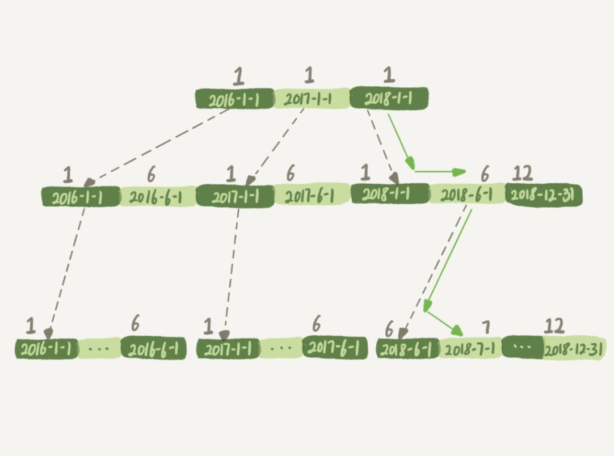
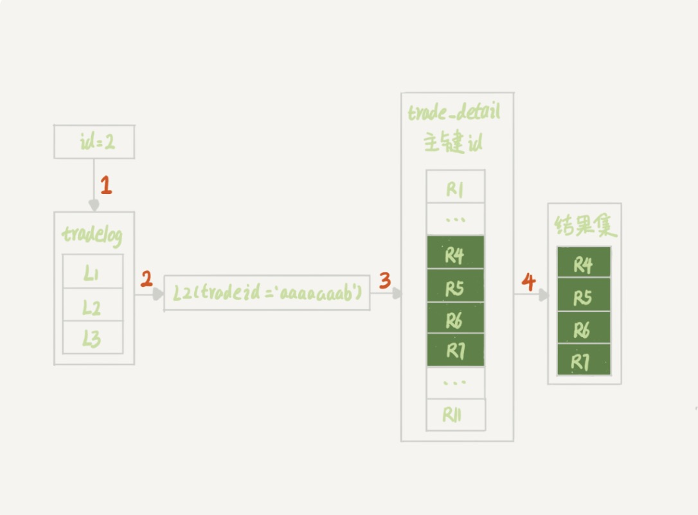

# 为什么SQL语句相似但是逻辑相差巨大


[TOC]
-----------------------------------------
## 案件一：条件字段函数操作
```mysql
mysql> CREATE TABLE `tradelog` (
  `id` int(11) NOT NULL,                // 日志id
  `tradeid` varchar(32) DEFAULT NULL,   // 交易流水号
  `operator` int(11) DEFAULT NULL,      // 操作员id
  `t_modified` datetime DEFAULT NULL,   // 交易时间
  PRIMARY KEY (`id`),
  KEY `tradeid` (`tradeid`),
  KEY `t_modified` (`t_modified`)
) ENGINE=InnoDB DEFAULT CHARSET=utf8mb4;
```

### 要统计七月份的交易记录总数，但是发现执行地很慢
```mysql5
mysql> select count(*) from tradelog where month(t_modified)=7;
```

### 原因分析

+ 1. 如果对t_modified这个字段进行了计算就用不上索引了, 这是MySQL的规定
+ 2. 索引树也决定了如果传入的是月份的话，在索引树上就不知道该怎么进行查找了。对索引字段做函数操作的时候，可能会破坏索引值的有序性，因此优化器就决定放弃走树搜索功能。
+ 3. 优化器可以选择遍历主键索引和t_modified索引，哪个索引小自然就选择了哪个。这里是指全索引扫描。
+ 4. explain的时候发现extra字段的值是using index, 表示这次查询使用了覆盖索引。
+ 5. 优化器在遇到即使不会改变索引有序性的情况下也是不会考虑使用索引的：select * from t where id+1=1000;

### 优化
```mysql
mysql> select count(*) from tradelog where
    -> (t_modified >= '2016-7-1' and t_modified<'2016-8-1') or
    -> (t_modified >= '2017-7-1' and t_modified<'2017-8-1') or 
    -> (t_modified >= '2018-7-1' and t_modified<'2018-8-1');
```

-----------------------------------------
## 案件二：隐式类型转换
```mysql
// 这两个语句实际上是等效的，所以在做隐式转换的时候
mysql> select * from tradelog where tradeid=110717;
mysql> select * from tradelog where  CAST(tradid AS signed int) = 110717;
```

```mysql
select * from tradelog where id='1';
```

### 本来可以走索引的但是确走了全表扫描，发现执行起来很慢

### 原因分析
+ 1. 这个字段的类型是varchar(32) 但是输入的确实int类型的，内部会进行一个隐式转换的。
+ 2. 数据类型转换规则
    + a. 数字 > 字符串
+ 3. 为什么会有数据类型转换，就需要走全表扫描
    + a. 解释略暂时不知道
+ 4. 神奇的就是第二条查询语句，explain查看了以后，发现走了索引。


-------------------------------------------
## 案件三：隐式字符编码转换
```mysql5
mysql> CREATE TABLE `trade_detail` (
  `id` int(11) NOT NULL,
  `tradeid` varchar(32) DEFAULT NULL,
  `trade_step` int(11) DEFAULT NULL, /* 操作步骤 */
  `step_info` varchar(32) DEFAULT NULL, /* 步骤信息 */
  PRIMARY KEY (`id`),
  KEY `tradeid` (`tradeid`)
) ENGINE=InnoDB DEFAULT CHARSET=utf8;

insert into tradelog values(1, 'aaaaaaaa', 1000, now());
insert into tradelog values(2, 'aaaaaaab', 1000, now());
insert into tradelog values(3, 'aaaaaaac', 1000, now());

insert into trade_detail values(1, 'aaaaaaaa', 1, 'add');
insert into trade_detail values(2, 'aaaaaaaa', 2, 'update');
insert into trade_detail values(3, 'aaaaaaaa', 3, 'commit');
insert into trade_detail values(4, 'aaaaaaab', 1, 'add');
insert into trade_detail values(5, 'aaaaaaab', 2, 'update');
insert into trade_detail values(6, 'aaaaaaab', 3, 'update again');
insert into trade_detail values(7, 'aaaaaaab', 4, 'commit');
insert into trade_detail values(8, 'aaaaaaac', 1, 'add');
insert into trade_detail values(9, 'aaaaaaac', 2, 'update');
insert into trade_detail values(10, 'aaaaaaac', 3, 'update again');
insert into trade_detail values(11, 'aaaaaaac', 4, 'commit');
```

```mysql5
mysql> explain select d.* from tradelog l, trade_detail d where d.tradeid=l.tradeid and l.id=2;
```


### 执行过程分析
    在这个执行计划中首先从tradelog中取出tradeid字段，再去trade_detail表里面查询匹配字段。所以这里我们把tradelog称为是驱动表。trade_detail称为被驱动表。而tradeid称为被驱动字段。

+ 1. 根据id在tradelog表中找到L2那一行
+ 2. 从L2这一行中取出tradeid的信息
+ 3. 再根据tradeid的值去trade_detail表中查找条件匹配的行，explain里面第二行中key=NULL表示的就是这个过程是通过遍历主键索引的方式，一个个判断tradeid是否匹配的。

### 原因分析
+ 1. 这两张表使用的字符集不同，所以在做表连接查询的时候使用不上关联字段的索引。
+ 2. `mysql> select * from trade_detail where tradeid=$L2.tradeid.value; ` 这里这个`$L2.tradeid.value`的字符集就是utf8mb64；有问题的阶段三就可以改成这条语句了。
    + a. 因为utf8mb64是utf8的超级，所以mysql在做比较的时候，会先进行一个转换。为的是避免数据在转换过程中由于截断导致的数据错误，所以会将数据往长度增长的方向上进行转换的。
    + b. `select * from trade_detail where CONVERT(traideid USING utf8mb4)=$L2.tradeid.value; ` 所以mysql内部相当是做了这样的一个动作。
+ 3. 所以为什么走了全表扫描的原因还是因为使用了函数的缘故。


```mysql5
mysql>select l.operator from tradelog l , trade_detail d where d.tradeid=l.tradeid and d.id=4;
```


### 执行过程分析
    可以在上图中看到执行计划中首先从trade_detail中取出主键id=4的那一行的tradeid字段的值，然后再去tradelog表中查找匹配到tradeid的合适的值。所以这里trade_detail就变成了驱动表，然后tradelog就是被驱动的表。同样tradeid还是驱动字段。
    但是神奇的事情就是 为什么这次两次查询都走了索引呢？
+ 1. `select operator from tradelog  where traideid =$R4.tradeid.value; `相当于是走了这步。
+ 2. `select operator from tradelog  where traideid =CONVERT($R4.tradeid.value USING utf8mb4); ` 这里函数是使用在值上的所以说还是走了索引，没有影响。

### 优化方案
+ 1. 到trade_detail标上将tradeid字段转换成utf8mb4编码。
    `alter table trade_detail modify tradeid varchar(32) CHARACTER SET utf8mb4 default null;`
+ 2. 如果因为数据量比较大因此不能做这个DDL动作的话，就只能采用修改SQL语句的方法了。
    `mysql> select d.* from tradelog l , trade_detail d where d.tradeid=CONVERT(l.tradeid USING utf8) and l.id=2; `


## 小结
+ 1. 对索引字段做函数操作，可能会破坏索引值的有序性，因此优化器就会决定放弃走树搜索的功能。

## 思考题
    还有没有别的类似这种会影响性能的操作吗？