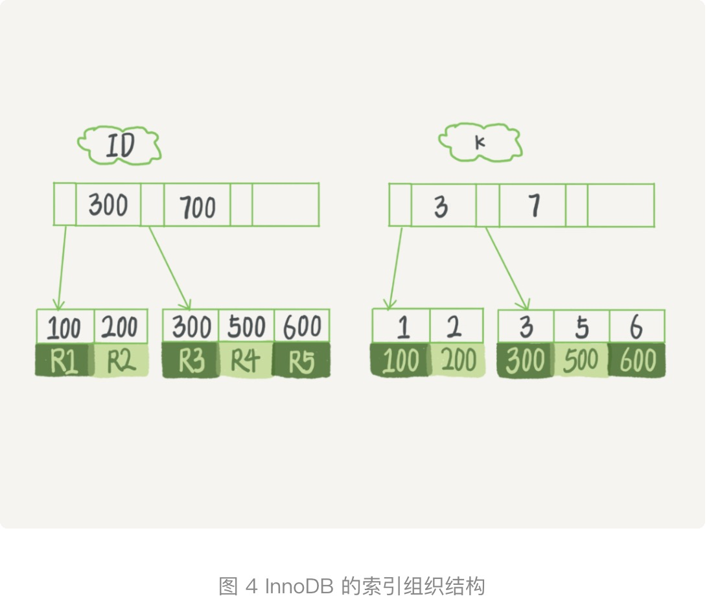
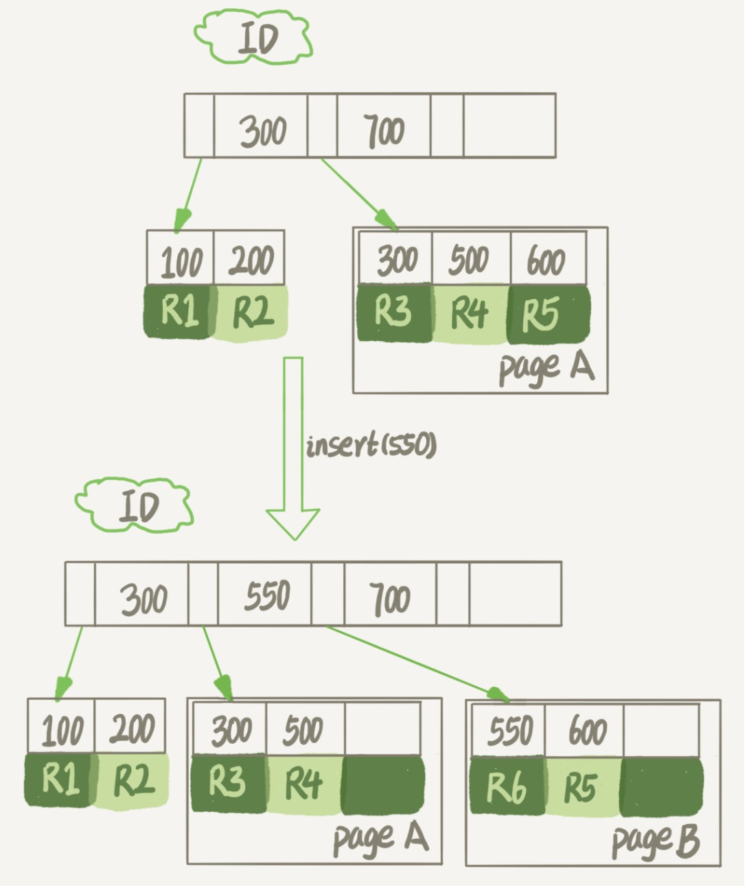

# 为什么表文件删掉一般，表大小不变
    针对InnoDB进行讨论，一个表结构包含两部分：表结构定义+表数据，表结构定义所占的空间非常小

[TOC]
---------------------------------

## innodb_file_per_table
+ def
    + OFF
        表的数据放在共享表空间里
    + ON（MySQL5.6.6以后默认值）
        表的数据放在单独的一个文件里(后缀:.idb)


## 数据删除流程
    B+Tree的一个结点就是一个数据页

    
+ 记录的复用
  
        假如我们现在要删除R4这条记录, InnoDB引擎只会将R4这条记录标记为清除，因为如果之后要插入一个ID在300和600之间的记录的话，可能会复用这个位置。因此磁盘文件的大小并不会有什么改变。
    
+ 只限于符合范围条件的数据(也就是说只有插入一条在300到600之间的记录才会复用到R4的空间)
  
+ 数据页的复用
  
        假如一个数据页上的所有记录都被清除的时候，这个数据页就会被标记为可复用。
    
+ 可以复用到任何位置

### 引起空洞的操作
+ 合并数据页
    如果两个相邻的数据页的利用率都比较低的时候，系统会把这两个数据页的数据合并到一个页上，另外一个数据页上就标记为可复用。

+ delete操作
    记录的复用 + 数据页的复用 + 不回收表空间
    
+ insert操作


    随机插入数据的时候可能会引起索引的数据页分裂，比如插入一条550的数据，这时候pageA已经满了 就会变成引起数据页分裂，分裂完成以后，pageA的页尾就留下了一个空洞。

+ update操作
    delete + insert；同理也是会引起空洞的。

### 重建表解决"空洞"
    经过大量增删改的表可能会留下大量的空洞，重建表可以把这些空洞去掉。假如现在有表A需要做空间收缩。
+ OUTLNE DDL:
    建一个可表A结构相同的表B，按照主键递增的顺序，一行一行地从表A中读取，插入表B。如果这个表B作为临时表，数据导入完成以后，使用表B替换表A，就可以达到表空间收缩的效果。
    ```mysql
    alter table A engine=InnoDB
    ```
    使用这条语句时，临时表B不需要我们自己创建，MySQL5会自动帮我们创建，转存数据，交换表名，删除旧表的操作。
    + 注意：
        这条语句进行的时候表A不能进行更新，这条DDL不是Online的。

+ ONLINE DDL(MySQL5.5.6以后): （数据定义语言）
    + 1. 创建一个临时文件，扫描表A主键的所有数据页。
    + 2. 用数据页中表A的记录生成B+Tree，存储到临时文件中。
    + 3. 生成临时文件的过程中，将所有对A的操作记录在一个日志文件中
    + 4. 临时文件生成后，将日志文件中的操作应用到临时文件中，得到一个逻辑数据上与表A相同的数据文件。
    + 5. 用临时文件替换表A的数据文件。

    + ps: 在DDL之前是要拿到MDL写锁的，按道理来说其它事务是无法对这个表进行更改的，也就说不上是online ddl了，但是其实在拷贝数据之前，这个MDL写锁就会退化成读锁，这样就不会堵塞增删改的操作。这里的MDL锁针对的是临时表。

    + 消耗：以上操作都很消耗CPU和IO资源。
    + 前两种创建的tmp_table都是存放在server层面的

+ INPLACE DDL
    tmp_file是在InnoDB内部创建的，整个DDL过程都是在InnoDB内部完成的。对于server层来说，并没有将数据挪动到临时表中，所以这是一个"原地"操作。因此叫做inplace。
    + tmp_file 也是要占用空间的
    + `alter table t engine=InnoDB`
    + `alter table t engine=innodb,ALGORITHM=inplace;`
    + `alter table t add FULLTEXT(field_name);`
        这个过程是inplace的，但会阻塞增删改查的操作，是非online的
    + 如果一个DDL是online，就一定是inplace, 但如果是inplace,就不一定是online的了。

## 三种重建表方式的区别
+ alter table
    默认上面所说的流程
+ analyze table
    并不是重建表，只是对表的索引信息做重新统计，没有修改数据，这个过程中加了MDL读锁。
+ optimize table
    recreate + analyze

## 思考题
    现在有一个表t文件，大小为1T；
    对这个表执行 alter table t engine=InnoDB；
    发现执行完成后，空间不仅没变小，还稍微大了一点儿，比如变成了1.01T
