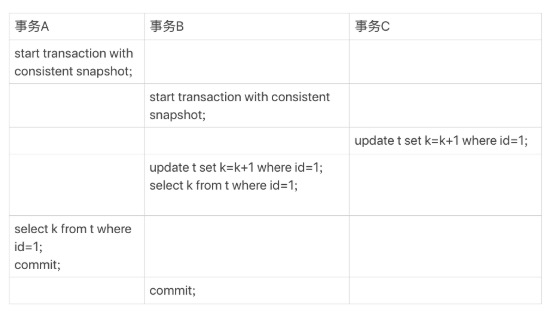
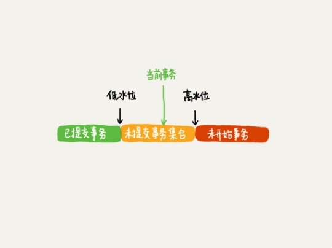
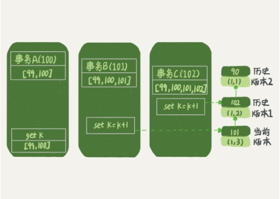

# 第八讲： 事务到底是隔离的还是不隔离的

[TOC]
---------------------------------

## 再探事务隔离级别的实现

### repeatable read
    一个事务在启动的时候，能够看到其它事务commit以后的事务结果，而且会创建一个read-view 视图。这个事务执行期间，其它事务额更新都对这个事务不可见。    

### 行锁
    当有两个事务同时对数据表中的同一行进行更新操作时，一个事务要获取到行锁才能进行更新，也就是要等待另一个事务提交了以后才能拿到行锁，对数据表那一行进行操作。

### 例子
```mysql
mysql> CREATE TABLE `t` (
  `id` int(11) NOT NULL,
  `k` int(11) DEFAULT NULL,
  PRIMARY KEY (`id`)
) ENGINE=InnoDB;

insert into t(id, k) values(1,1),(2,2);
```

#### 启动事务
+ 1. begin/start transaction 命令并不是一个事务的起点，跟在后面操作InnoDB表的语句，事务才是真正的启动。
+ 2. 如果想马上启动一个事务可以使用：start transaction with consistent snapshot 这个命令。

#### 问题描述

+ 1. 事务C没有显示使用begin/commit,表示这个update语句本身就是一个事务，语句在完成的时候会自动提交。
+ 2. 事务B在更新了行之后进行查询
+ 3. 事务A在一个只读事务中查询，并且查询在事务B之后
+ 4. 这个时候很可能事务B查询到的和事务A查询到的是不同的值。

#### MySQL中有两个'视图'的概念
+ 1. 用查询语句定义的虚拟表，在调用的时候执行查询语句并返回一个虚拟表，创建视图的语法是create view... 查询语句就和普通的查询语句是一样的。
+ 2. 在InnoDB在实现MVCC的时候用到的一致性读视图(consistent read view), 用于支持RC(read committed)和RR(read repeatable) 隔离级别的实现。

---------------------------------
## “快照”在MVCC中是怎么工作的(InnoDB根据数据由多个版本的特性实现秒级快照)

    在RR事务隔离级别下，事务在启动的时候就“拍了一个快照”，这个快照是基于整个库的。

### 事务ID(transaction id)
+ 每一个事务都有一个唯一的id,是在事务开始的时候向事务系统申请的，按照申请的顺序严格递增的。

### 数据版本id(row trx_id)
+ 每行数据都是有多个版本的，每次事务在更新数据的时候，都会生成一个新的数据版本.row_trx_id = transaction id, 同时旧的版本也会保留。**这个版本在commit之前就生成了**。

### 行状态变更过程

+ 语句更新会生成undo log，每个版本都是由当前版本和undo log计算出来的。
+ 需要V2的时候，通过V4依次执行U3和U2计算出来的。
+ InnoDB为每个事务都构造了一个数组，用来保存这个事务在启动瞬间，当前正在活跃的所有事务ID。“活跃”：启动但是未提交。当前系统里面已经创建过的事务ID最大值+1记为高水位，数组里面足最小的事务ID就是低水位。这个视图数组和高水位组成这个事务的一致性视图也就是黄色的部分其实就是read-view。

### 数据本本的可见性规则

+ 一个数据版本，对于一个事务视图来说，除了事务自己更新的数据总是可见以外
    + 版本如果未提交，数据不可见
    + 版本已提交，但是是在视图创建完成以后提交的，不可见
    + 版本已提交，是在视图创建完成之前提交的，可见

+ 如果现在有一个一致性视图，高水位是18，也就是说trx_id=18,所以当前数据版本是V4，会根据undo log中的U3操作将数据恢复到V3版本。对于这个事务来说，它看到的数据是k=11;

### 分析事务A的返回结果，为什么k=1

+ 在事务A开始之前，系统里只有一个活跃的事务，事务ID=99
+ 事务A, B, C的三个版本号分别是100，101，102
+ 事务A, B, C开始之前，数据的版本号是row_trx_id=90

        事务A的视图数组是[99, 100],事务B的视图数组是[99, 100, 101],事务C的视图数组是[99, 100, 101, 102]
+ 事务A在查询的时候，事务B都**还没有提交**，当前数据版本就已经变成101。但是这个版本对于事务A来说是不可见的。事务A的read-view=[99, 100], 它只能看见低水位之前的版本，即row_trx_id=90的版本的数据。102这个数据版本是在事务A开始以后，才提交的，也是看不见的。

---------------------------------
## 更新逻辑

    事务B作出的更新是当前版本101.事务B开始以后，事务C才提交，所以102版本的数据是看不到的。同样只能看到90版本的数据。也就是k=1; 那么更新以后的结果应该是(1, 2)，为什么更新以后是(1, 3)?
### 更新数据都是先读后写，只能读当前版本的值，称为“当前读”。

### 不光是update语句是"当前读"的，select语句如果加上锁，也是"当前读"。
```mysql
// 读锁 共享锁
mysql> select k from t where id=1 lock in share mode;
// 写锁 排他锁
mysql> select k from t where id=1 for update;
```
    
### 如果现在事务B在事务C未提交之前就加锁想要进行“当前读”, 会发生什么？
+ 1. 事务C此时拿着行锁，对行进行写操作。写锁和读锁以及写锁都是互斥的。
+ 2. 事务B想要进行当前读，必须拿到行锁(读锁)。
+ 2. 事务B会阻塞，根据二阶段锁协议，等到事务C提交以后，行锁才会被释放。此时事务B才能开始当前读的操作。

---------------------------------
## RC 和 RR 的实现区别？
### RC
    每一个语句在执行前都会重新计算出一个新的视图
### RR
    在每个事务开始的时候计算出一个一致性视图，之后这个事务里的所有操作都在这个一致性视图上进行。


---------------------------------
## 思考题
    事务隔离级别是可重复读。现在要把c=id的行的c的值更改为0.但是却发现改不掉，这是为什么？
### 题目
```mysql
mysql> CREATE TABLE `t` (
  `id` int(11) NOT NULL,
  `c` int(11) DEFAULT NULL,
  PRIMARY KEY (`id`)
) ENGINE=InnoDB;
insert into t(id, c) values(1,1),(2,2),(3,3),(4,4);
```
### update语句
```mysql
update t set c=0 where id=c;
```
### 解答：
    update这条语句 可以分成两个部分看，分别是 get id=c 的行数 然后再 set c=0
    
