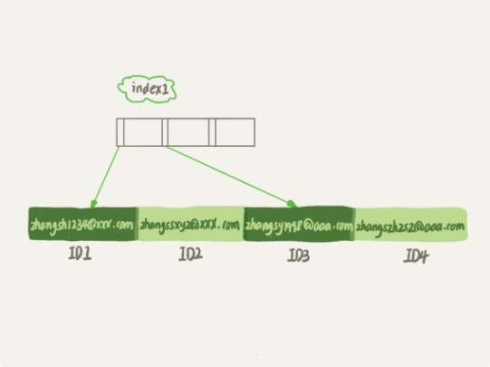
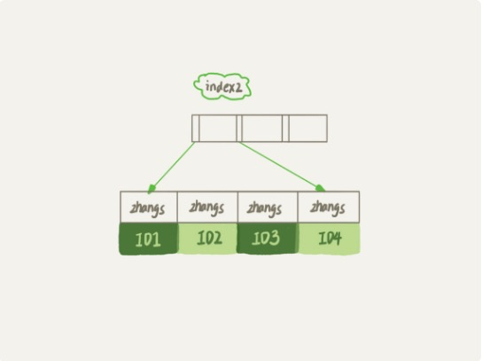

# 怎么给字符串字段加索引

## 前缀索引

### 创建
```mysql
mysql> create table SUser(
    ID bigint unsigned primary key,
    email varchar(64),
    ...
)engine=innodb;

// 创建部分索引
mysql> alter table SUser add index index1(email);             // 如果不指定字符串长度的话就是整个字符串当作索引
mysql> alter table SUser add index index2(email(6));          // 指定这个字段的前6个字符创建索引

// 查询语句
mysql> explain select f1, f2 from SUser where email='xxx';
```

## 索引结构图
### 完整索引结构图

### 部分索引结构图


### 分析
#### 如果使用的是index1
+ 1. 从index1索引树上找到满足索引值’zhangssxyz@xxx.com’的这条记录，取得ID2的值；
+ 2. 到主键上查到主键值为ID2的主键，判断email值是正确的，将这行记录加入结果集；
+ 3. 取index1索引树上的刚刚查到的位置的下一条记录，发现已经不满足email='zhangssxyz@xxx.com',循环至此结束；
#### 如果使用的是index2
+ 1. 在index2索引树上找到满足索引值为'zhangs'的值，找到的第一个值是ID1；
+ 2. 去主键上查找主键值为ID1的行，判断email是否等于'zhangssxyz@xxx.com',不相等则进行丢弃；
+ 3. 取index2索引树上找到的那一条数据的下一条数据，再去主键上查找主键值为ID2的行，判断email是否正确，正确就保留。
+ 4. 重复这个过程。

### 优势
+ 1. 前缀索引所占用的空间更加小
+ 2. 前缀索引大概率上会导致查询次数增多，但是这和定义前缀索引的个数有关系。
+ **所以使用好前缀索引，定义好长度，既可以节省空间，也不用增加太多的查询成本，当然这个长度就是按照区分度来确定的**
```mysql
select count(distinct left(email, 4)) as L4, 
       count(distinct left(email, 5)) as L5,
       count(distinct left(email, 6)) as L6,
       count(distinct left(email, 7)) as L7
from SUser;
```

## 前缀索引对覆盖索引的影响
    如果索引包含了查询所需要的所有的字段，那么这个索引就是覆盖索引。也就是说不需要回表操作了。
**如果使用了前缀索引 就不能使用覆盖索引了**

### compare
```mysql
select id,email from SUser where email='zhangssxyz@xxx.com';
```
    针对这条查询语句，如果这时候使用的是index1, 就不需要进行一个回表的动作了。但是如果使用的是部分索引，结果就不一样了。即使 length of email is 18; 建立索引的时候使用的是 add index index2(email(18)); 但是在查询的时候，InnoDB依旧会进行回表，因为不确定到底截断的部分的主键值是不是正确的。


## 其他方式
### 倒序存储
```mysql
mysql> select field_list from t where id_card = reverse('input_id_card_string');
```
    前提还是以前6位作为索引，并且每次存储的时候都以倒序的方式进行存储。不过这也是基于身份证后6位区分度好的特性来优化的。
### 使用hash字段
```mysql
mysql> alter table t add id_card_crc int unsigned, add index(id_card_crc);
```
    在表上再创建一个整数字段，用来保存身份证的校验码，同时在这个字段上面创建索引。当然这样的话就要每次在插入数据的时候，都同时使用crc32()这个函数得到校验码然后填入这个新字段中。但是这个函数可能会导致两个不同的身份证号，计算得出相同的校验码。所以在查询的时候要判断id_card的值是否精确相同。
```mysql
mysql> select field_list from t where id_card_crc=crc32('input_id_card_string') and id_card='input_id_card_string'
```
### 两种方式的异同点
#### 相同点
+ 都不支持范围查询 只是支持等值查询
#### 不同点
+ 占用额外的内存空间
    + 倒序存储方式是在主键索引上，不会消耗额外的存储空间。但是使用hash字段的话要额外增加一个单位的空间。但是使用倒序存储索引的话4个字节的空间恐怕不够，所以这一消耗可以抵消。
+ 在CPU消耗方面
    + 倒序存储在每次读和写的时候都会使用reverse()函数，而是用hash的时候，只需要在插入的时候调用一次crc32()。但是如果只是从两个函数的计算复杂度来看，就reverse()的计算开销要小一点。
+ 在查询效率方面
    + 使用hash字段查询的性能要相对稳定一点，因为crc32()算出来的值虽然会有冲突的可能，但是冲突的可能很小。


## 思考题
    学生登录名字的统一格式是“学号@gmail.com”，学号的规则是，十五的数字，前三位是所在的城市编号，第四-第六位就是城市编号，第七-第十是入学年份，最后五位则是顺序编号。系统在登陆的时候都要完整地输入登录名字和规则，验证成功以后才能登录系统。如果只考虑登录验证的环节，你会怎么设计这个登录名的索引呢？

