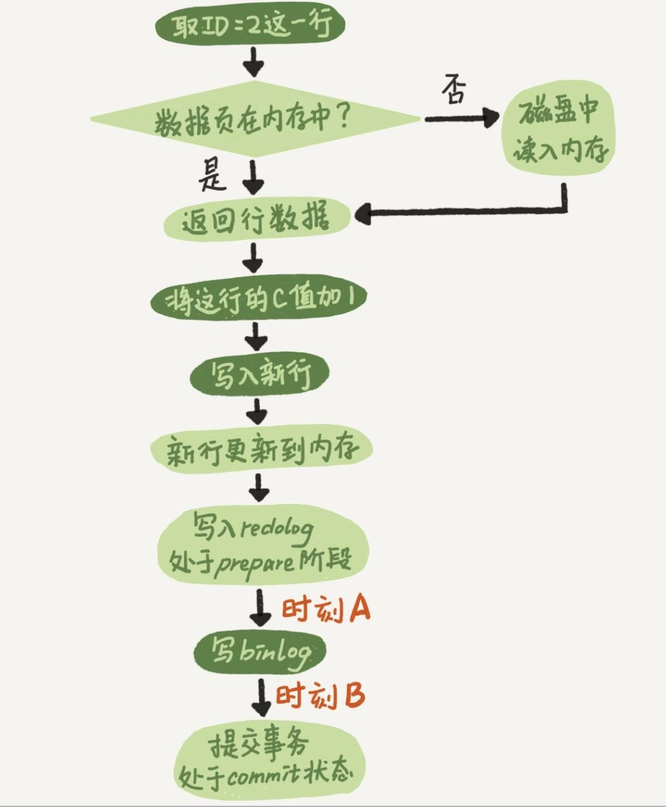

# 答疑文章:日志和索引相关的问题

[TOC]

-----------------------------
## 回顾一下
    redolog是InnoDB拥有的，binlog是Server层的。redolog是记录反向操作的，binlog记录的就是操作，是用来归档用的。

## 日志相关的问题

### 两阶段提交的不同时刻，MySQL异常重启会出现什么现象
+ 时刻A的时候出现崩溃，redolog还没有提交，崩溃恢复的时候，这个事务会发生回滚，这个时候binlog还没有开始写，所以不会传到备库中。
+ 时刻B的时候出现崩溃，首先看一下崩溃恢复时的判断原则。
    + 1. 如果redolog里面的事务是完整的，也就是已经有了commit标示的时候，就会直接提交。
    + 2. 如果redolog里面的事务只有prepare,则判断对应事务的binlog是否存在并完整；
        + a. 如果是，就提交事务
        + b. 如果不是，则回滚事务
        所以时刻B的时候，在崩溃恢复的时候就会进行事务提交。

### MySQL怎么知道binlog是完整的？
    一个事务的binlog是有一个完整的格式的。
+ statement格式，最后会有commit;
+ row格式的binlog，最后会有一个XID event;

### redolog 和 binlog 是怎么关联起来的
    它们都有一个共同的字段(XID)。崩溃恢复的时候，会按顺序扫描redolog。
+ 如果碰到既有prepare,又有commit的redolog,就直接提交。
+ 如果碰到只有prepare,没有commit的redolog,就拿着XID去binlog找对应的事务。

### 处于prepare阶段的redolog加上完整的binlog，重启以后就能恢复，为什么MySQL要这样做。
    binlog写完以后MySQL崩溃，这时候binlog已经写入了，之后就会被从库使用，所以在主库上也要提交这个事务才能保持数据的一致性。

### 其实还有一些问题，感觉不太好理解了，所以先放一放。