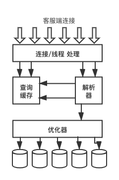

# 第一章：MySQL 的架构和历史

## 1.1 MySQL 的逻辑架构



+ **第一层服务**：连接处理、授权认证、安全等

+ **第二层架构**：查询解析、分析、优化、缓存、内置函数。所有跨存储引擎的功能都在这一层实现：存储过程、触发器、视图等。

+ **第三层存储引擎**：存储引擎负责 MySQL 中数据的存储和提取。服务器通过 API 与存储引擎进行通信。

### 1.1.1 连接管理和安全性

+ 连接管理

        每个客户端连接都会在服务器进程中拥有一个线程，这个连接的查询只会在这个单独的线程中执行。线程只能轮流在某个 CPU 核心运行，服务器会负责缓存线程，因此不需要为每一个新建的连接创建或者销毁线程。

+ 安全性
  
  + 基于用户名、原始主机信息、密码认证
  
  + 基于 SSL 方式连接，X.509 证书认证（一旦客户端认证成功，服务器会继续验证客户端是否具有执行某个特定查询的权限）

### 1.1.2 优化与执行

+ *查询缓存*：只针对 SELECT 语句

+ *解析查询，创建内部数据结构(解析树)*

+ *优化查询 (重写查询: mysqld 的 rewritter 插件、表的读取顺序、选择合适的索引)*
  
  + **关键字提示(hint)优化器**：提示优化器按照一定的方式去优化，影响其决策过程。
  
  + **请求优化器解释(explain)优化过程的各个因素**: 知道是如何进行优化决策的。
  
  + **存储引擎**
    
    + 优化器会请求存储引擎提供容量 或 某个具体操作的开销信息，以及表数据的统计信息等等。某些存储引擎的某种索引，可能对一些特定的查询有优化。

### 1.2 并发控制

#### 1.2.1 读写锁

+ 共享锁(shared lock) / 读锁
  
  + (读锁之间)互不阻塞

+ 排他锁(exclusive lock) / 写锁
  
  + 一个写锁会阻塞其他的写锁和读锁

#### 1.2.2 锁粒度

        提高共享资源的并发性的方式就是让锁定对象更有选择性。尽量只锁定需要修改的部分数据，而不是锁全部的资源。

        加锁消耗资源，如获得锁，检查锁是否已经删除、释放等，这些都会增加系统的开销，对系统的性能也会造成影响。

**两种 MySQL 中最重要的锁策略**

1. 表锁(table lock)
  
   a. 并发性能较行级锁低，开销最小。
   
   b. 写锁优先级高于读锁，一个写锁请求可能会被插入到读锁队列的前面。反之不行。
   
   c. ALTER TABLE 产生表锁，忽略存储引擎的锁机制。

2. 行级锁(row lock)
  
   a. 最大程度支持并发处理，开销最大。
   
   b. 只在存储引擎层面实现(InnoDB、XtraDB), MySQL 的服务器层没有实现。
   

#### 1.3 事务

​		一组原子性的 SQL 查询。

+ ACID 的概念

  + atomicity(一个事务被视为一个不可分割的最小工作单元)
  + consistency(数据库总是从一个一致性状态变为另一个一致性状态)
  + isolation(通常来说，一个事务所做的修改在最终提交以前，对其他的事物是不可见的)
  + durability(一旦事务提交，所做的修改就会永久保存到数据库中)

  **保证 ACID 需要更强的 CPU 处理能力、更大的内存和更多的磁盘空间，对于一些不需要事务的查询类应用，选择一个非事务型的存储引擎可以获得更高的性能。**即使存储引擎不支持事务，也可以使用 LOCK TABLE 提供一定程度的保护。

#### 1.3.1 隔离级别

​		MySQL 可以执行 `set transaction isolation level read commited;` 来设置隔离级别。

+ **Read uncommitted（性能不会好多少，不建议用）**
  + 事务的修改没提交之前对其它事务也是可见的 
  + 后果：dirty read
+ **Read commited (nonrepeatable read)**
  + 事务的修改没被提交之前对其它事务是不可见的
  + 后果：一个事务读两次记录可能读到不同的结果，不可重复读

+ **Repeatable read（MySQL的默认隔离级别）**
  + 保证一个事务中多次读取同样的记录的结果是一致的
  + 后果：phantom row, 一个事务在读取某个范围内的记录时，另一个事务又在该范围内插入新记录，再次读取则会出现幻行。
  + InnoDB 通过 MVCC(多版本并发控制) 和 间隙锁(nest-key locking) 解决 phantom row 的问题
+ **Serializable**
  + 强制事务串行执行, 会在读取的每一行数据上都加锁.
  + 后果：大量超时，锁争用，不支持并发

#### 1.3.2 死锁

+ **概念**

  指两个或者多个事务在同一资源上相互占用，并请求锁定对方占用的资源，从而导致恶性循环的现象。

+ **场景**

  + 多个事务试图以不同的顺序锁定资源，可能产生死锁
  + 多个事务同时锁定同一资源时，可能产生死锁

+ **example**

  ```sql
  -- 前提肯定是在 MySQL 默认的隔离级别下
  start transaction;   -- 事务1
  update student set name = 'caiqj' where id = 1;   -- 产生行锁
  update student set name = 'sb' where id = 2;   -- 写锁在事务2那里
  commit;
  
  start transaction;   -- 事务2
  update student set name = 'lydia' where id = 2;    -- 产生行锁
  update student set name = 'all of us' where id = 1;  -- 写锁在事务1那里
  commit
  ```

+ **解决方式**

  死锁发生以后，只有部分或者完全回滚其中一个事务，才能打破死锁。anyway, InnoDB 发生死锁会直接返回一个错误。

  + 死锁检测
  + 死锁超时机制

  **MySQL InnoDB 目前的处理方式：将持有最少行级排他锁的事务进行回滚**

  *锁的行为和顺序是和存储引擎相关的，以同样的顺序执行语句，有的存储引擎会产生死锁，有的则不会产生，而有些则是因为数据冲突导致的*

#### 1.3.3 事务日志

+ 修改表的数据时只需要修改其内存拷贝
+ 该修改行为记录到持久在硬盘上的事务日志中
+ 事务日志持久后，内存中被修改的数据在后台可以被慢慢刷回磁盘

我们通常称为 **预写式日志(Write-Ahead Logging)**, 因此修改数据需要写两次磁盘。

*如果数据的修改已经记录到事务持久化，但是数据本身还没有写回到磁盘，此时系统崩溃，存储引擎在重启时能够自动恢复这部分修改的数据，具体的恢复方式视存储引擎而定*

#### 1.3.4 MySQL 中的事务

​		MySQL 提供了两种事务型的存储引擎，InnoDB 和 NDB Cluster。也就是说，事务其实并不是在 MySQL 的服务器层实现的。

+ **AutoCommit(MySQL 默认)**

  如果不是显示地开始一个事务，则每个查询都被当作一个事务执行提交操作。在当前连接中，可以通过设置 AUTOCOMMIT 变量来启用或者是禁用。

  也就是说当禁用自动提交，需要显式执行 commit 或 rollback，该事务才算是结束。

  ```sql
  show variables like 'AUTOCOMMIT';
  ```
  + MyISAM 或 内存表，没有事务的概念。所以修改 AUTOCOMMIT 也没有影响。
  + `alter table` `lock tables` 等一些语句在执行之前会强制执行 commit 提交当前的活动事务。

+ **在事务中混合使用存储引擎**

  Example: 在一个事务中同时用到 InnoDB 表和 MyISAM 表。

  后果：回滚的时候 MyISAM 表上的变更无法撤销。

+ **隐式和显式锁定**

  InnoDB 采用的是*两阶段锁定协议 (two-phase locking protocol)*，锁只有在 commit 或 rollback 的时候才会被释放，并且所有的锁都是同一时刻被释放。两阶段的意思就是分成两个阶段执行 加锁/解锁。

  + 隐式锁定

    InnoDB 会根据隔离级别在需要的时候自动加锁。

  + 显示锁定

    `select ... lock in share mode`

    `select ... for update`

    `lock tables`  在服务器层实现

  **tips: 出了事务中禁用 AUTOCOMMIT 的时候可以使用 `lock tables`，其他情况不要显示使用锁表语句，不管使用的是什么存储引擎**

### 1.4 多版本并发控制(MVCC)

​		MVCC 通过保存数据在某个时间点的快照来实现每个事务不管需要执行多长时间，看到的数据都是一致的这一点。可以认为 MVCC 是行级锁的一个变种，但是它在很多情况下都避免了加锁操作。因此*开销更低*。**不同存储引擎的 MVCC 实现是不同的，典型的有 乐观(Optimistic)并发控制 和 悲观(pessimistic)并发控制。**

+ **只在 repeatable read 和 read committed 两个隔离级别下工作**

+ MVCC 工作流程(InnoDB 的简化版 - Repeatable read)

  每条行记录都会有两个隐藏列，一列是当前行的创建时的系统版本号, 一列是删除时的系统版本号。每开始一个新事务时，系统版本号都会递增。

  + **SELECT(符合两个条件的前提下查询每行数据)**

    1. 只查找创建版本小于等于当前数据行的事务版本。确保事务读的行要么就是一开始就有的，要么就是事务自身插入或修改过的。
    2. 只查找删除版本没有 或者 大于当前数据行的事务版本，确保事务读的行之前没有被删除过。

  + **INSERT**

    为新插入的每一行保存当前系统版本号作为当前的行创建版本号。

  + **DELETE**

    为删除的每一行保存当前系统版本号作为当前的行删除版本号。

  + **UPDATE**

    1. 插入一行新记录，保存当前系统版本号作为行创建版本号。
    2. 保存当前系统版本号到原来的行作为行删除版本号。

    `update student set address='Shanghai' where address='Zhejiang'`

    | name  | address  | created_version | deleted_version |
    | :---: | :------: | :-------------: | :-------------: |
    | Lydia | Zhejiang |       V1        |       V2        |
    | Lydia | Shanghai |       V2        |        /        |

+ 优点
  
  + 大多数读操作都可以不用加锁。因此读操作简单且性能会很好。
+ 缺点
  + 每行都多保存了两列额外的数据，产生存储开销。
  + 更多的行检查工作、维护工作 

### 1.5 MySQL 的存储引擎

+ 使用文件系统的目录和文件来保存数据库和表的定义
  1. 一个数据库就是一个子目录
  2. 表定义存在 table_name.frm 文件中(表的定义是在 MySQL 的服务器层统一进行处理的)
+ `show table status like 'table_name'` 查看表使用的存储引擎
  1. data_length 表数据的大小，字节为单位。
  2. max_data_length 表数据的最大容量，和存储引擎有关
  3. index_length 索引的大小
  4. **rows 表中的行数，MyISAM 中该值是精确的，InnoDB 中该值是估值。**

#### 1.5.1 InnoDB(MySQL 默认)

​		被设计于处理大量的短期(shorted-lived)事务。

+ InnoDB 的数据**存储**在表空间(table space)中，由一系列的数据文件组成。
+ InnoDB 采用 **MVCC** 支持高并发，实现了四个标准的隔离级别，默认级别是 repeatable read。MVCC 和 间隙锁(nest-key locking)可以解决幻行的问题。nest-key locking 使得 InnoDB 不仅仅锁定查询所涉及的行，还会对索引中的间隙做锁定，防止幻行的插入。
+ InnoDB 表是基于聚簇索引建立的，聚簇索引对主键查询有很高的性能。但是他的二级索引中必须包含主键列，因此如果表上的索引较多的话，主键应当尽可能的笑。
+ InnoDB 内部做了很多优化，包括从磁盘读取数据时采用的可预测性预读，能够自动在内存中创建 hash 索引以加速读操作的自适应哈希索引(adaptive hash index)，能加速插入操作的插入缓冲区等。
+ 官方手册中的 "InnoDB 事务模型与锁" 一节。有必要详细阅读。

#### 1.5.2 MyISAM

​		支持全文索引、压缩、空间函数等。不支持事务和行级锁。适用于**日志型**的应用。

+ MyISAM 的数据**存储**在两个文件中，数据文件和索引文件，分别以 .myd 和 .myi 为扩展名。
+ **有表锁无行锁**，读取的时候加共享锁，写入时则加排他锁，但表有读取查询的同时也可以进行插入动作(**并发插入 concurrent insert**)
+ 即使是 BLOB 和 TEXT 等长字段，也可以基于前500个字符创建索引。支持**全文索引**。并且可以选择**延迟更新索引键(delayed key write)**机制，每次修改执行完成时，不会立刻将修改的索引数据写入磁盘，而是会先写入内存中的**键缓冲区(in-memory key buffer)**，*只有在清理键缓冲区或者关闭表的时候才会将对应的索引块写入磁盘。*这样当如可以提升写操作的性能，但是在数据库或者主机崩溃的时候造成索引损坏。
+ 如果表在创建并导入数据以后，不会再进行修改操作，这样的表或许是和采用**MyISAM 压缩表**。可以极大减少磁盘占用，减少磁盘I/O，从而提升查询性能。压缩表支持索引，但是索引也是只读的。

#### 1.5.3 CSV 引擎

​		可以将普通的 CSV 文件作为 MySQL 的表来处理，但是这种表不支持索引。

#### 1.5.4 Memory 引擎

​		所有的数据都保存在内存中，不需要进行磁盘 I/O, 比 MyISAM 表至少快一个数量级。但是重启以后表结构会保留，数据则会消失。可以用来保存数据分析中产生的中间数据，用于查找或者映射表，用于缓存周期性聚合数据的结果。支持 hash 索引，但是是表级锁，因此并发差。且每行的长度是固定的，因此会造成内存的浪费。

#### 1.5.5 选择合适的引擎

​		Oracle 在 MySQL  5.5 版本中将 InnoDB 作为默认的存储引擎，之前是拿 MyISAM 当作默认存储引擎。如果想用全文索引，建议 InnoDB + Sphinx 组合，而不是 MyISAM。除非不得已，不建议混合使用多种存储引擎。

+ 备份：InnoDB 支持在线热备份
+ 崩溃恢复：MyISAM 崩溃以后发生损坏的概率大于 InnoDB，而且恢复速度慢
+ 只有MyISAM 支持地理空间搜索

##### 1.5.5.1 日志型应用

​		假如你需要实时地记录一台中心电话交换机的每一通电话的日志到 MySQL 中，或者将所有网站的访问信息直接记录到表中，这一类应用对插入速度有很高的要求(我觉得还有一点就是对数据的准确性没有绝对严格的要求)，用 MyISAM 或者 Archive 存储引擎比较合适，因为他们**开销低、插入速度非常快**。

​		**假如需要对记录的日志做分析表，则会导致插入效率明显降低**

​		**一种解决方法**，将数据复制一份到备库，然后在备库上执行比较消耗时间和CPU的查询，主库只用于高校的插入操作。

​		**另一种解决方法**，在日志记录表的名字中加上年月日的信息，这样查询旧表的时候不会影响新表的插入性能。

##### 1.5.5.2 只读或者大部分情况下只读的表

​		比如编制泪目或者分类清单(如工作岗位，竞拍，不动产这些)。这些场景就是典型的读多写少的业务。如果不介意 MyISAM 的崩溃恢复问题，选它是合适的(MyISAM 只将数据写到内存中，然后等待操作系统定期地将数据刷到磁盘上)。

##### 1.5.5.3 订单处理

​		订单处理是一定要支持事务的，另外考虑存储引擎对外键的支持情况。(?)

##### 1.5.5.4 CD-ROM 应用

​		考虑 MyISAM 或者 MyISAM 压缩表，这样表之间可以隔离，并且可以在不同的介质上相互拷贝。不过不要忘记压缩表是只读的。

#### 1.5.6 转换表的引擎

**ALTER TABLE**

`alter table mytable engine=InnoDB;`

+ 优点：适用于任何引擎。   
+ 缺点：需要执行很长的时间。并且会失去和原引擎相关的所有特性，比如外键。
+ 原理：MySQL 会按行将数据从原表复制到一张新表中，在复制期间可能会消耗系统所有的 I/O 能力，同时还会给原表加上读锁。

**导入和导出**

​		mysqldump 工具将数据导出到文件，修改文件中的 create table 语句来修改存储引擎。并且要注意 mysqldump 会在 create table 前面加上 drop table，要小心数据丢失。

**创建与查询(create 和 select)**

Insert into innodb_table select * from myisam_table;

**pt-online-schema-change** 可以在线更改表结构。

### 1.7 总结

​		MySQL 拥有分层的架构，上层是服务器层的服务、查询执行引擎，下层是存储引擎，服务器层和存储引擎层之间通过 API 来回交互。

​		MySQL 最初基于 ISAM 创建，后来被 MyISAM 取代，再后来就是 InnoDB。


